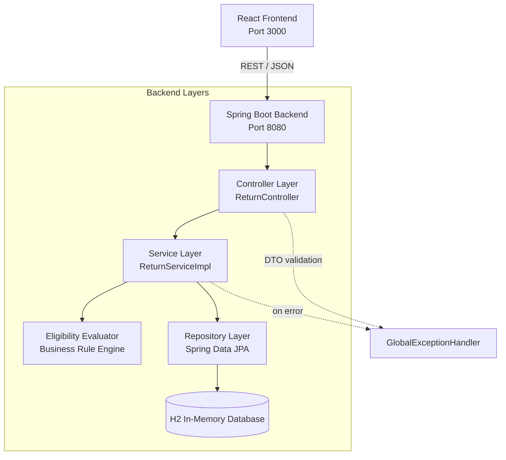

# Order Returns System

A full-stack web application that lets customers submit product return requests and automatically evaluates them against a retailer's return policy — instantly approving, rejecting, or flagging the request for manual review.

Built as a full-stack demonstration project showcasing return request processing, business rule evaluation, REST API development, and frontend-backend integration using React and Spring Boot.

Frontend: React (Vite)
Backend: Spring Boot, Spring Data JPA, H2 Database

---

## Overview

When a customer wants to return an item, the system checks two things automatically:

1. **Is it still within the 30-day return window?**
2. **What condition is the item in (unused, opened, or damaged)?**

Based on those two factors, the system immediately assigns a status — no manual queue, no waiting — and shows the customer (and the ops team, via the dashboard) exactly why that decision was made.

---

## Features

- Submit a return request with order details, purchase date, reason, and item condition
- Automatic eligibility evaluation at submission time (30-day window + condition rule)
- Returns dashboard with all submitted requests
- Filter dashboard by status (Submitted / Approved / Pending Review / Rejected)
- Human-readable decision reason attached to every request (e.g. "Item is damaged and not eligible for return")
- Responsive UI with loading and error states
- RESTful API with consistent error responses and input validation
- In-memory H2 database, pre-seeded with sample data for instant demo

---

## Architecture

The system follows a standard layered architecture on the backend and a simple component-based structure on the frontend.



**Why this structure?**
- **Controller** only handles HTTP concerns (status codes, request/response shape) — no business logic.
- **Service** owns the business rule and transaction boundary.
- **Eligibility Evaluator** is a standalone component holding just the approval logic, so it can be unit-tested without spinning up Spring or a database.
- **Repository** is a thin Spring Data JPA interface — no custom SQL needed for this scope.
- **GlobalExceptionHandler** centralizes error formatting so controllers stay clean.

---

## Folder Structure

```
returns-backend/
├── pom.xml
├── src/main/java/com/retail/returns/
│   ├── ReturnsApplication.java
│   ├── controller/
│   │   └── ReturnController.java
│   ├── service/
│   │   ├── ReturnService.java
│   │   └── ReturnServiceImpl.java
│   ├── repository/
│   │   └── ReturnRequestRepository.java
│   ├── entity/
│   │   ├── ReturnRequest.java
│   │   ├── ItemCondition.java
│   │   └── ReturnStatus.java
│   ├── dto/
│   │   ├── ReturnRequestDTO.java
│   │   ├── ReturnResponseDTO.java
│   │   └── ErrorResponse.java
│   ├── exception/
│   │   ├── GlobalExceptionHandler.java
│   │   ├── ResourceNotFoundException.java
│   │   └── InvalidStatusException.java
│   └── util/
│       └── ReturnEligibilityEvaluator.java
├── src/main/resources/
│   ├── application.properties
│   └── data.sql
└── src/test/java/com/retail/returns/service/
    └── ReturnEligibilityEvaluatorTest.java

returns-frontend/
├── index.html
├── vite.config.js
├── package.json
└── src/
    ├── main.jsx
    ├── App.jsx
    ├── api/
    │   └── returnApi.js
    ├── components/
    │   ├── ReturnForm.jsx
    │   ├── ReturnsDashboard.jsx
    │   ├── ReturnCard.jsx
    │   ├── StatusBadge.jsx
    │   ├── StatusFilter.jsx
    │   ├── Loader.jsx
    │   └── ErrorMessage.jsx
    └── styles/
        └── index.css
```

---

## Business Rules

| Rule | Outcome |
|---|---|
| Purchase date more than 30 days ago | **REJECTED** — return window expired (checked first, overrides condition) |
| Item condition: `UNUSED`, within window | **APPROVED** |
| Item condition: `OPENED`, within window | **PENDING_REVIEW** — flagged for manual inspection |
| Item condition: `DAMAGED`, within window | **REJECTED** — not eligible regardless of timing |

The 30-day window check always runs first. A damaged item bought yesterday is rejected for condition; an unused item bought 45 days ago is rejected for being outside the window. Every decision is stored with a plain-English reason (`decisionReason`) so the outcome is never a mystery — to the customer or to whoever's debugging the system later.

`SUBMITTED` exists as a status value but is resolved synchronously the moment a request is created — there's no queue or async step in this scope, so a request transitions straight to its final status.

---

## API Documentation

Base URL: `http://localhost:8080`

### Create a return request

`POST /returns`

**Request:**
```json
{
  "orderId": "ORD-2001",
  "productName": "Air Fryer",
  "purchaseDate": "2026-06-01",
  "returnReason": "Doesn't fit my needs",
  "itemCondition": "UNUSED"
}
```

**Response — `201 Created`:**
```json
{
  "id": 7,
  "orderId": "ORD-2001",
  "productName": "Air Fryer",
  "purchaseDate": "2026-06-01",
  "returnReason": "Doesn't fit my needs",
  "itemCondition": "UNUSED",
  "status": "APPROVED",
  "decisionReason": "Item is unused and within the 30-day return window",
  "createdAt": "2026-06-17T10:22:00"
}
```

**Validation error — `400 Bad Request`:**
```json
{
  "timestamp": "2026-06-17T10:20:11",
  "status": 400,
  "error": "Validation Failed",
  "message": "One or more fields are invalid",
  "details": ["productName: productName is required"]
}
```

### Get all return requests

`GET /returns` → `200 OK`, returns an array of return objects (same shape as above).

### Get a return request by ID

`GET /returns/{id}` → `200 OK` with the object, or `404 Not Found`:
```json
{
  "timestamp": "2026-06-17T10:25:00",
  "status": 404,
  "error": "Not Found",
  "message": "Return request not found with id: 99",
  "details": null
}
```

### Get return requests by status

`GET /returns/status/{status}` where `{status}` is one of `SUBMITTED`, `APPROVED`, `PENDING_REVIEW`, `REJECTED`.

Example: `GET /returns/status/APPROVED` → `200 OK`, array filtered to that status.

Invalid status value → `400 Bad Request` via `InvalidStatusException`.

---

## Setup Instructions

**Prerequisites:** Java 21, Maven 3.9+, Node.js 18+, npm.

### Backend
```bash
cd returns-backend
mvn clean install
```

### Frontend
```bash
cd returns-frontend
npm install
```

---

## Run Instructions

### 1. Start the backend
```bash
cd returns-backend
mvn spring-boot:run
```
Runs on `http://localhost:8080`. H2 console available at `http://localhost:8080/h2-console` (JDBC URL: `jdbc:h2:mem:returnsdb`, user: `sa`, no password).

### 2. Start the frontend
```bash
cd returns-frontend
npm run dev
```
Runs on `http://localhost:3000` and talks to the backend on port 8080.

### 3. Try it out
Open `http://localhost:3000`, submit a return request, and watch it appear in the dashboard with its computed status. Sample data is pre-loaded so the dashboard isn't empty on first load.

### Run backend tests
```bash
cd returns-backend
mvn test
```

---

## Assumptions

- A return request is evaluated exactly once at creation time; there's no workflow for re-evaluating or appealing a decision.
- "30 days" is calculated as calendar days from purchase date to the current date, inclusive of day 30.
- No authentication/authorization — this is a single-tenant demo, not a production multi-customer system.
- `PENDING_REVIEW` requests have no follow-up action in this scope (e.g. no "approve manually" endpoint) — flagging it is the deliverable, not resolving it.
- One product per return request, matching the assessment's field list (no multi-item returns/carts).
- CORS is fully open (`*`) for local development convenience; this would be restricted to a specific origin in a real deployment.

---

## Future Enhancements

- Manual approve/reject endpoint for `PENDING_REVIEW` items, with an audit trail of who decided and when
- Authentication and role-based access (customer vs. ops/admin views)
- Pagination and sorting on `GET /returns` for larger datasets
- Persistent database (PostgreSQL/MySQL) instead of in-memory H2
- Email/notification on status change
- Multi-item return requests tied to a single order
- Admin analytics: return rate by product, average time-to-decision
